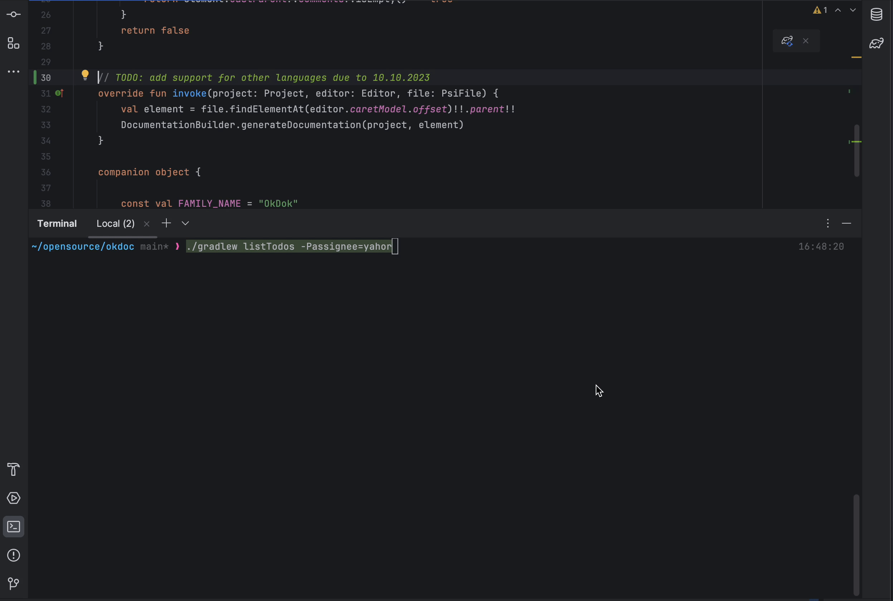

# ToDoMe: Your No-Nonsense, Get-It-Done Gradle Plugin
## Introduction

Welcome to ToDoMe, your new conscience in the coding world. This Gradle plugin has been forged in the fires of countless forgotten TODOs and is here to ensure that no TODO is left behind.


## Purpose

With ToDoMe, you're making a commitment to quality, diligence, and follow-through. TODOs are no longer optional. They're no longer something for the future. They're here, they're now, and they're your top priority. 

## How It Works

ToDoMe works by scanning your Java/Kotlin/Groovy code for any TODO comments. But it doesn't stop there. It checks for a due date in every TODO. If it finds a TODO without a due date, your build fails. Brutal? Yes. Effective? Absolutely.

In addition, ToDoMe can list all your TODOs, filtered by assignee and sorted by due date. This makes it easy to manage your tasks and prioritize your work.

## Installation
Include the following to your build.gradle:
```groovy
plugins {
    id 'com.yahorbarkouski.todome' version '1.0.3'
}
```
Or if you're using kotlin DSL:
```kotlin
plugins {
    id("com.yahorbarkouski.todome") version "1.0.3"
}
```

Run the Gradle sync task to download the plugin and integrate it into your project.

## Configuration

The plugin provides a `todome` for additional configuration options, so you can specify different due date prefixes and the date format to use:

```groovy
todome {
    // default is 'due to'
    dueDatePrefixes = ['due to', 'deadline']
    // default is 'dd.MM.yyyy'
    dateFormat = 'd MMM yyyy'
}
```

## Usage
Run the `verifyTodos` task to check your code for TODOs without due dates. If any are found, your build will fail. No way to ignore.
```bash
./gradlew verifyTodos
```

List your TODOs, filtered by assignee and sorted by due date using the listTodos task. You can specify an assignee and sort order as command line properties. If not, the default assignee is "all" and the default sort order is "desc".
```bash
./gradlew listTodos -Passignee=yahor -Psort=asc
```



## Remember

Every TODO is a promise. A promise to your code, to your users, and to yourself. With ToDoMe, you're going to keep those promises. So, roll up your sleeves, buckle down, and get to work. Your TODOs are waiting.